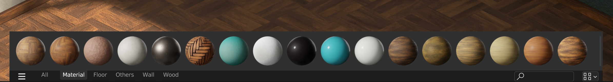
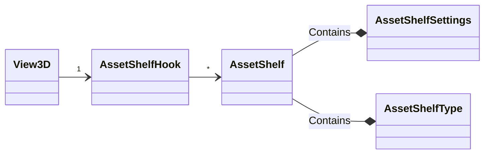

# Asset Shelf

An Asset Shelf provides fast and convenient access to assets from specific editors, without having to open an Asset Browser. It is optimized for using assets for a specific task (for example animating with pose assets, or painting with brush assets), and as such is more limited in functionality than the Asset Browser, but more efficient for certain contexts of use.



The asset shelf uses the _All_ asset library, and makes use of [asset catalogs](../backend/asset_catalogs.md) for efficient navigation within it.

Not all editors support asset shelves. Enabling them for a new editor requires some work, as explained [below](#adding-asset-shelf-support-to-an-editor).

## Source Code Locations

Most asset shelf code can be found in:

| Location                                                       | Description                                                                                                    |
| -------------------------------------------------------------- | -------------------------------------------------------------------------------------------------------------- |
| `source/blender/editors/asset/intern/`**`asset_shelf_xxx.cc`** | Main asset shelf source files.                                                                                 |
| `source/blender/editors/asset/`**`ED_asset_shelf.h`**          | API to integrate asset shelves in editors.                                                                     |
| `source/blender/blenkernel/`**`BKE_screen.h`**                 | `AssetShelfType` definitions.                                                                                  |
| `source/blender/makesdna/`**`DNA_screen_types.h`**             | DNA type declarations (supporting file read/write): <br/> `AssetShelf`, `AssetShelfSettings`, `AssetShelfHook` |
| `source/blender/makesrna/`**`rna_ui.c`**                       | RNA integration (the Python API is generated from this).                                                       |
| `scripts/startup/bl_ui/`**`asset_shelf.py`**                   | Generic asset shelf UI elements.                                                                               |

## Custom Asset Shelves

To display an asset shelf in a specific context, and for specific kinds of assets, a new asset shelf type can be registered. In Python this works like this:
```.py
class VIEW3D_AST_sculpt_brushes(bpy.types.AssetShelf):
    bl_space_type = "VIEW_3D"

    @classmethod
    def poll(cls, context):
        return bool(context.object and context.object.mode == 'SCULPT')

    # Temporary design!
    @classmethod
    def asset_poll__(cls, asset):
        return asset.file_data.id_type == 'BRUSH'
```

This will display an asset shelf in sculpt mode, for assets that are of ID type `BRUSH`.

> WARNING: **Temporary Design**
> The `asset_poll__` method is meant as a temporary design solution. In future this should be handled via a `bl_traits` dictionary or list (i.e. `bl_traits = {'BRUSH'}`). Blender's Python API doesn't support this syntax for defining a collection of strings using dictionaries or lists yet.

A template for this can be found in the Text Editor under _Templates_ > _Python_ > _Ui Asset Shelf_.

#### Custom Activation Behavior

When clicking on an asset, it becomes active in the UI. For the asset shelf you'd often want this to *apply* some asset, e.g. to apply the clicked on pose asset or activate the clicked on brush asset. This can be done by overriding the keymap item for clicking in the asset shelf.

In the `register()` function of a script/add-on (using the pose library as an example here):

```.py
# Asset Shelf
km = wm.keyconfigs.addon.keymaps.new(name="Asset Shelf")
# Click to apply pose.
kmi = km.keymap_items.new("poselib.apply_pose_asset", "LEFTMOUSE", "CLICK")
addon_keymaps.append((km, kmi))
```

The asset shelf provides context that the operator of the keymap item can use, see [Context](#context).

#### Custom Drag & Drop Behavior

The behavior for dragging can be overridden in a similar fashion. However, the default asset dragging has to be disabled in the asset shelf type definition first:

```.py
class VIEW3D_AST_pose_library(bpy.types.AssetShelf):
    # ...
    bl_options = {'NO_ASSET_DRAG'}
    # ...
```

And then override the keymap item for dragging in the asset shelf:
```.py
# Asset Shelf
km = wm.keyconfigs.addon.keymaps.new(name="Asset Shelf")
# Drag to blend pose.
kmi = km.keymap_items.new("poselib.blend_pose_asset", "LEFTMOUSE", "CLICK_DRAG")
addon_keymaps.append((km, kmi))
```


#### Custom Context Menu

Customizing the context menu for the asset shelf and a specific asset is trivial too:

```.py
class VIEW3D_AST_pose_library(bpy.types.AssetShelf):
    # ...

    @classmethod
    def draw_context_menu(cls, context, asset, layout):
        layout.operator(...)

        # ... More regular layout code
```

## Asset Shelf Management

### Available Asset Shelf Types

Note that the asset shelf type is registered for a specific editor type, *3D View* in the example above. When an editor of this type is shown, its registered asset shelf types are polled on every redraw. Once the `poll()` of an asset shelf type returns `True`, that indicates that this asset shelf type is available. The system can then try to restore a previously instanced asset shelf of this type, or create a new one if needed.

### Multiple Available Asset Shelf Types

It is possible that multiple asset shelf types are available (i.e. multiple shelf types return `True` in their `poll()` in a given context). To keep the system simple, only one shelf can be visible in an editor at a time. This is considered to be the *active* shelf. The user could be presented with a selector to choose from one of the available asset shelf types when necessary, but this isn't implemented yet.

Previously active shelves are kept in memory. When the active shelf becomes unavailable, these previously active ones get polled in order from most recently to least recently activated. So as context changes, the most recently used asset shelves get priority in determining the new shelf to activate. Otherwise, the first registered asset shelf type that is available will be used to create a new asset shelf to activate from.

> INFO: **Alternative Solution**
> The alternative would be merging settings from multiple asset shelves into a runtime asset shelf. When writing the asset shelves to a file, they could all be written with the same settings (or somehow be split?). This could be done but doesn't seem necessary for now.

## UI components

### Regions

The asset shelf is split in two regions:

__Main Region__
: The region displaying the assets in a grid-view  (see [views](https://wiki.blender.org/wiki/Source/Interface/Views) documentation).

: This region uses paginated scrolling and strict region size snapping, so that it always 1 or more full row of assets, never a partial asset row.

: Region types: `RGN_TYPE_ASSET_SHELF` in C, `ASSET_SHELF` in Python.

__Footer Region__
: Contains display options, filter controls and the catalog tabs.

: Region type: `RGN_TYPE_ASSET_SHELF_FOOTER` in C, `ASSET_SHELF_FOOTER` in Python.

### Asset View

See `asset_shelf_asset_view.cc`.

The main region displays assets in a grid-view using the [UI view](https://wiki.blender.org/wiki/Source/Interface/Views) system for its layout. It defines default drag controllers, and calls the necessary callbacks of the asset shelf type, such as the `draw_context_menu()` method. The asset view uses the [asset list API](../backend/asset_list_api.md) to fetch the asset library.

### Asset Catalog Selector

See `asset_shelf_catalog_selector.cc`.

The asset catalog selector uses a [tree-view](https://wiki.blender.org/wiki/Source/Interface/Views/Tree_Views) for its layout. Its main puprose is to enable or disable asset catalogs in the settings of the asset shelf (`AssetShelfSettings.enabled_catalog_paths`). The displayed tree is the merged tree, so multiple catalogs with the same path show up as a single element in the tree. To be able to display the catalog tree, it loads the asset library using the [asset list API](../backend/asset_list_api.md) (although it should already be loaded by the [Asset View](#asset-view)).

## Context

Asset shelves broadcast data to context while one of the asset shelf regions is active in context (e.g. while the mouse hovers one and nothing overrides it).

The following data members are added:

**`"asset_shelf"`**
: The active shelf, if any (`AssetShelf`).

**`"asset_library_ref"`**
: The asset library reference currently visible in the active shelf (`AssetLibraryReference`)

**`"active_file"`**
: The file representing the asset. Temporary workaround, should be replaced by a proper asset representation or handle (`FileDirEntry`).

## Storage



Asset shelves store their data mostly through the following structs:

**`AssetShelfHook`**
: Container for spaces to embed all permanent asset shelf data. This contains a list of `AssetShelf` instances (the storage of previously active asset shelves) and information on the active shelf. Availability of the active shelf is queried on redraws, so the active shelf may change on context changes.

**`AssetShelf`**
: Data of a single shelf, created by activating a shelf of a given `AssetShelfType`. Holds type information and settings, whereby settings are stored in a nested `AssetShelfSettings` member.

**`AssetShelfSettings`**
: The settings for an `AssetShelf` instance such as the enabled asset catalogs and other display options.
: See `asset_shelf_settings.cc`.

**`AssetShelfType`**
: Runtime type information like the identifier and callbacks of the asset shelf.


Except of the runtime-only `AssetShelfType`, these structs are part of SDNA so they can be written to .blend files.

## Adding Asset Shelf Support to an Editor Type

Making Asset Shelves available in an editor is not too hard, but requires some work still. The `ED_asset_shelf.h` header contains most public functions required for this. The following is a rough checklist to follow (not too specific since this can get outdated quickly).

TODO

- Add `AssetShelfHook` to the space data of the editor, and call the duplicate, file read and file write functions from the necessary places.
- Keymap?
- Theme options?

## FAQ

**Is it one asset shelf or multiple?**

: For the user, it is usually enough to refer to the two regions at the bottom with their contents as *asset shelf*. In more precise language, these can be considered the asset shelf regions, with contents defined by the active asset shelf data and the asset shelf type it was instantiated from. So multiple asset shelves are kept in storage (each of a different type), but only one is active (as in: visible) at a time.
