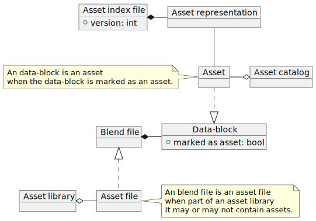
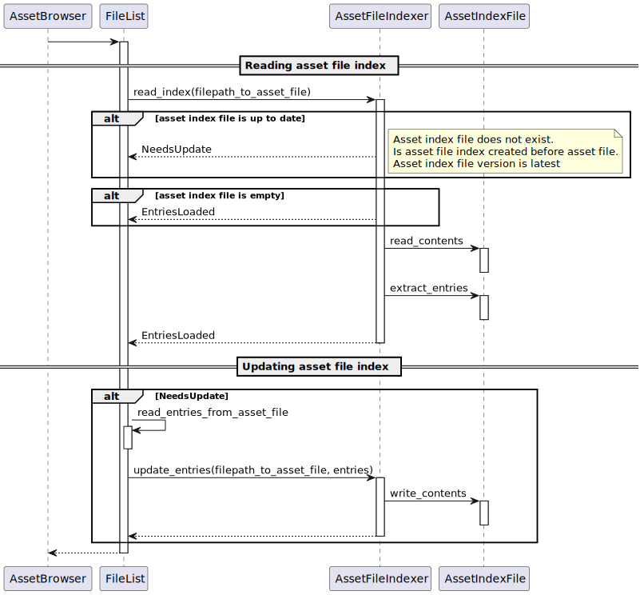

# Asset Indexing

Asset indexing provides an optimized way to load asset representations into the asset system. With asset indexing, users have to spend significantly less time waiting for asset libraries to be loaded and ready to use.

Information about the asset like its asset meta-data (link), name and data-block type is extracted from asset files and stored in asset index files. Asset indexing can observe the content of asset libraries to perform minimal updates to the asset index files.

The asset index files are stored in a local cache of the user's operating system.

## Glossary

Glossary used within the scope of this page.

__Asset__
: Data-blocks that have been tagged by users to be an asset.

__Asset File__
: Blend file which is located inside an asset library.

__Asset Library__
: See [Asset Library](https://wiki.blender.org/wiki/Source/Architecture/Asset_System/Back_End#Asset_Libraries) (Wiki).

__Asset Index File__
: JSON file containing information limited to selecting and browsing about assets contained inside a single asset file.

__Asset Catalog__
: See [Asset Catalos](asset_catalogs.md).

__Asset representation__
: See [Asset Representation](../fundamentals/index.md#asset-representation).

__File Browser__

: Editor in blender used for navigating file system and finding data-blocks in blend files. Used for linking, appending, file open, import, save and asset browsing functionalities.

__Data-block__
: See [ID Datablocks](https://wiki.blender.org/wiki/Source/Architecture/ID/ID_Type) (Wiki).

## Logical Overview



## Problem statement

Assets are stored in a blend file as part of an asset library. In order to browse through the assets of an asset library Blender has to parse each asset file in order to know which data-blocks have been tagged as assets. Doing this each time when browsing assets and having large asset libraries extracting the assets can take a long time.

* Blender loads asset files sequentially in a background thread, which is a slow operation.
* Asset libraries can be located on network shares and version controlled repositories.
* Asset libraries can have a large number of files.
* Asset files can be large is size.
* Asset files can be compressed.
* Asset files may not actually contain assets.

## Solution

To reduce the time needed to browse asset libraries we want to extract the assets representation from the asset files and store them in the asset index. When the asset file isn’t changed, the asset index file would contain the required information needed to be able to reconstruct the [https://wiki.blender.org/wiki/Source/Architecture/Asset_System/Back_End#Asset_Representation asset representation].

### Requirements

__Each asset file has an asset index file.__

Each asset file has an asset index file even when the asset file has no assets. The reason is that asset files can be part of an asset library without containing assets. For example when an asset file contains materials which are linked from assets inside a different asset file, but those materials are not assets themselves. If there was no index, the file would be parsed every time.

__Icons of assets are not part of the asset index file.__

Compared to the rest of the asset representation, icons can use a lot of disk space. Blender already has an icon manager that utilizes the OS to store and cache icons. Therefore we chose not to include the icon inside the asset representation.

__Empty asset files can be detected without opening the asset index file.__

Opening, reading and parsing asset index files has latency. Detecting if there are actually asset representations stored inside the asset index file after parsing isn’t efficient. By checking the file size on disk, the asset indexer can already check if there are any asset representations inside the asset index file, removing the need for opening, reading and parsing the file.

> INFO:
> The asset index is implemented as a [file indexer](https://hackmd.io/4PDN4EhISB2mwZFkIUtFFg) (`FileIndexerType`). Browsing assets shares logic with the file browser editor. File browser uses file indexers to read data from folders on a file-system, but also to list data-blocks located inside blend-files or data-blocks from asset libraries.
>
> The usage of the File browser for asset listing and `FileIndexerType` is planned to be refactored. (See {{Phab|T999999}})


## Asset library loading process



The sequence diagram shown above describes an overview control flow of the asset indexer. When the asset browser needs to know the asset representations that are inside an asset library it uses a <code>FileList</code>. The file list walks over the file inside the asset library and when an asset file is detected it invokes <code>read_index</code> on the <code>AssetFileIndexer</code>. <code>read_index</code> returns if the found asset representations (<code>EntriesLoaded</code>) or that the asset index file need to be updated for the given asset file.

If the asset file index requires an update, the file list extracts the asset representations from the asset file and invokes <code>update_index</code>. Update entries would create update or create the asset index file with the given asset representations.

## Asset Index

When browsing assets, asset indexes are created when they don’t exist or are out of date. The asset browser does not access asset files directly, but uses asset indexes.

### Storage

The asset index files are stored in the [https://docs.blender.org/manual/en/latest/advanced/blender_directory_layout.html#local-cache-directory local cache directory]. Within the local cache directory the indexes are stores using the following pattern: <code>/asset-library-indices/&lt;asset-library-hash&gt;/&lt;asset-index-hash&gt;_&lt;asset_file&gt;.index.json</code>.

`asset-library-hash`
: Hash of the absolute file path of the asset library.

`asset-index-hash`
: Hash of the absolute file path of the asset file.

`asset_file`
: Filename of the asset file. Not used by Blender, but is added for discoverability convenience.

### Content

```json
{
  "version": <file version number>,
  "entries": [{
    "name": "<asset name>",
    "catalog_id": "<catalog_id>",
    "catalog_name": "<catalog_name>",
    "description": "<description>",
    "author": "<author>",
    "tags": ["<tag>"],
    "properties": [..]
  }]
}
```

`version`
: the version of the asset index file. It is used to identify the structure of the content. Asset indexes with a different version than used by Blender would be regenerated. Blender 3.1-3.4 expect version attribute to be <code>1</code>.). Later versions might require to change it.

`entries`
: list of assets in the asset file related to the asset index.

`entries[].name`
: ID name of the asset, including its ID type prefix. (<code>OBSuzanne</code>).

`entries[].catalog_id`
: UUID of the catalog associated with the asset.

`entries[].catalog_name`
: Name of the catalog associated with the asset.

`entries[].description`
: Human readable description of the asset.

`entries[].author`
: Information about the author of the asset.

`entries[].tags`
: List of tags associated with this asset.

`entries[].properties`
: List of ID Properties associated with this asset.

## Performance

Performance is optimized for reading and parsing asset indexes.

* Asset libraries can have blend files that doesn’t contain any assets. To reduce opening and parsing an asset index that doesn’t contain any entries the size on disk of the asset index is checked. Asset indexes smaller than <code>MIN_FILE_SIZE_WITH_ENTRIES</code> would not be parsed and assumed to contain no entries.
* Asset indexes older than asset files are assumed to be out of date and should be regenerated. This can be determined without opening the asset index.
* Asset indexes of asset files on network shares are stored on your local system to reduce latency. Although this could depends on how your OS has been configured.

## Future expected changes

This section will contain a table with planned tasks and remark how it would change the asset indexing.

> WARNING: **To be added.**

## References

* Technical overview of asset catalogs: `https://wiki.blender.org/wiki/Source/Architecture/Asset_System/Catalogs`.
* The main source code is located at `source/blender/editors/asset/intern/asset_indexer.cc` and `source/blender/editors/asset/ED_asset_indexer.h`.
* End user documentation about assets library system `https://docs.blender.org/manual/en/latest/files/asset_libraries/introduction.html`, `https://docs.blender.org/manual/en/latest/files/asset_libraries/catalogs.html`
