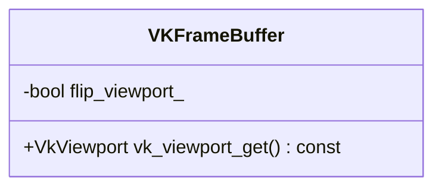

# VKFrameBuffer

## Viewport Orientation

Blender uses top left as the origin of the framebuffer. Vulkan uses the bottom left.
When drawing to the on-screen framebuffer each draw command is flipped. This is done
by providing a negative viewport.

Framebuffers have an attribute to indicate that all draw/blit operations to this frame
buffer should be flipped.

Draw commands are automatically flipped as the `VkViewport` created for the graphics
pipeline is flipped. This is done in `VKFrameBuffer::vk_viewport_get()`.

When transferring data from framebuffer A to framebuffer B the flipping only needs
to happen when `flip_viewport_` differs. When different the `dstOffsets` of the
`VkBlitCmdImage` is flipped. This is done in `VKFrameBuffer::blit_to`.

## References

* `source/blender/gpu/vulkan/vk_framebuffer.hh`
* `source/blender/gpu.vulkan/vk_framebuffer.cc`