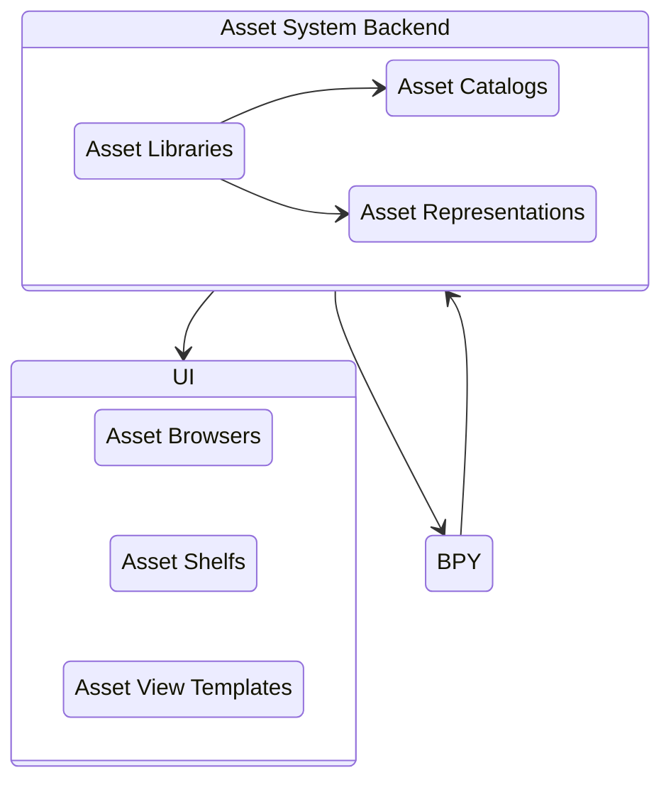

# Architectural Overview

The entire asset system can be stripped down to it's main components:

<!-- Abusing state diagrams a bit here :) -->

---

This is a more complete, but a bit outdated overview, including a number of helper classes:

.jpg)